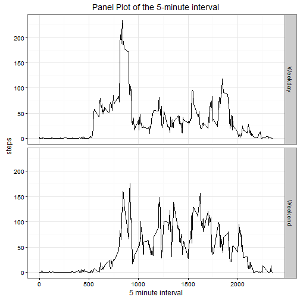

#Reproducible Research Assignment 1#  


```r
require(reshape2)
require(ggplot2)
```

###Reading the data and processing if needed###   

```r
data<-read.csv("C:\\AA\\CourseraDataScienceDataSets\\ReproducibleResearch\\activity.csv",header=TRUE)
data$date = as.Date(data$date, "%Y-%m-%d")
```
###Mean Median and Histogram of total number of steps taken per day###  


```r
stepsdata<-aggregate(x=data[c("steps")], by=list(data$date), FUN=sum, na.rm=TRUE)
hist(stepsdata$steps,main="Histogram of Steps Taken Per Day")
```


```r
mean(stepsdata$steps)
```

```
## [1] 9354.23
```

```r
median(stepsdata$steps)
```

```
## [1] 10395
```

###What is the average daily activity pattern?###    


```r
#New dataframe calculating average by interval
avgstepdata<-aggregate(x=data[c("steps")], by=list(data$interval), FUN=mean, na.rm=TRUE)
#Plotting the data
ggplot(avgstepdata, aes(x=Group.1,y=steps ))+ geom_line() + labs(title="Time series plot of the 5-minute interval", x="5 minute interval")
```


###Which 5-minute interval, on average across all the days in the dataset, contains the maximum number of steps?###   
**Answer: 835**    

```r
avgstepdata[which.max(avgstepdata$steps),]
```

```
##     Group.1    steps
## 104     835 206.1698
```

##Imputing missing values##    

###Calculate and report the total number of missing values in the dataset (i.e. the total number of rows with NAs)###

```r
#Calculates number of incomplete rows
sum((complete.cases(data)==FALSE))
```

```
## [1] 2304
```


###Devise a strategy for filling in all of the missing values in the dataset.###    
###We calculate mean for that 5-minute interval and use that value for imputing ###    


```r
ndata<-data

#FUnction whihc does the actual imputing of interval means
checkfn<-function(steps,interval){
  if(is.na(steps))
    steps<- avgstepdata$steps[avgstepdata$Group.1==interval]
  return(steps)
} 

ndata$steps<-mapply(FUN=checkfn,ndata$steps,ndata$interval)
```

###Histogram of the total number of steps taken each day after missing values are imputed### 

```r
newaggdata<-aggregate(x=ndata["steps"],by=list(ndata$date),FUN=sum)
hist(newaggdata$steps,main="Histogram of Total Steps Taken Per Day",20)
```


### New Mean and Median total number of steps taken per day after imputing ###

```r
mean(newaggdata$steps)
```

```
## [1] 10766.19
```

```r
median(newaggdata$steps)
```

```
## [1] 10766.19
```

The new calculated mean and median are higher than original as we have imputed NULL's with mean values and hence this increases these averages.    


###Are there differences in activity patterns between weekdays and weekends?###
###Panel Plot showing activity pattern differences between weekend and weekdays###

```r
#New factor variable weekday created
data$weekday<-ifelse(weekdays(data$date)=="Saturday" | weekdays(data$date)=="Sunday","Weekend","Weekday")

#Paverage number of steps taken per 5-minute interval across weekdays and weekends
avgstep<-aggregate(x=data[c("steps")], by=list(data$interval,data$weekday), FUN=mean, na.rm=TRUE)
ggplot(avgstep,aes(y=steps, x= Group.1)) + geom_line() + facet_grid(Group.2~.) + theme_bw()  + labs(title="Panel Plot of the 5-minute interval", x="5 minute interval")
```


